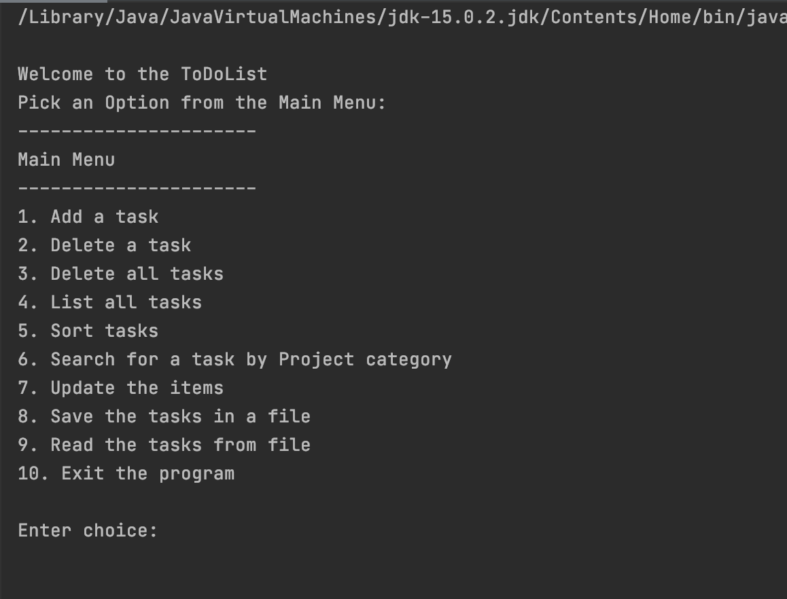
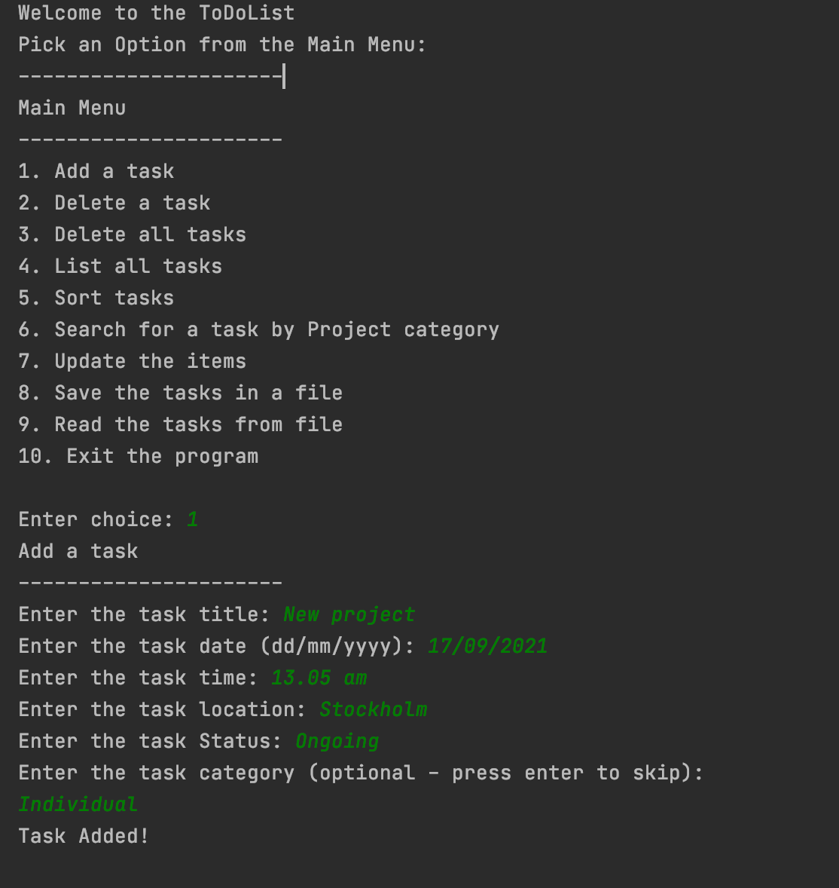
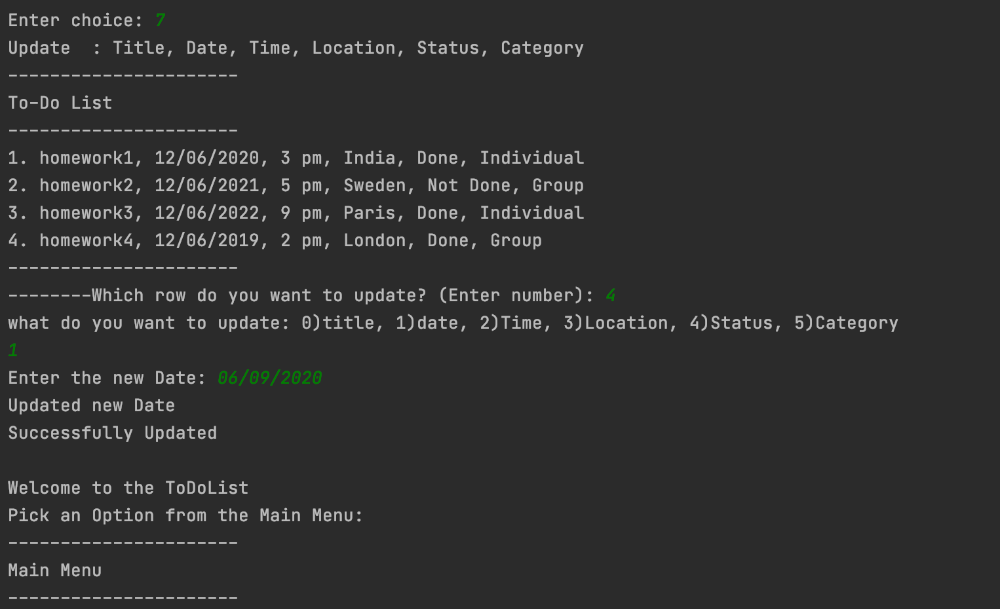
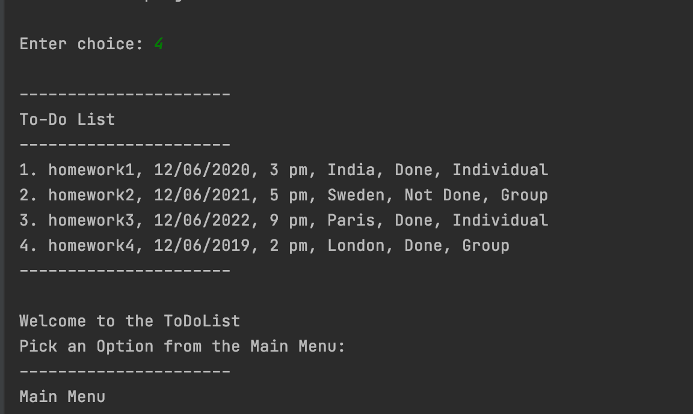
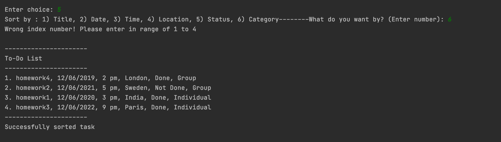
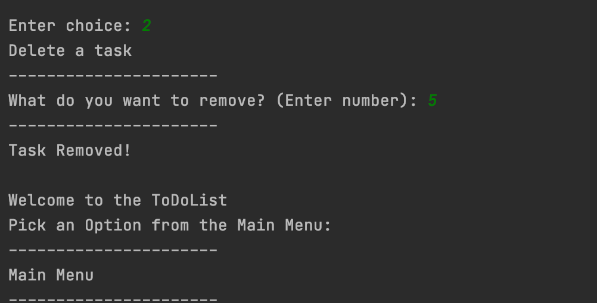
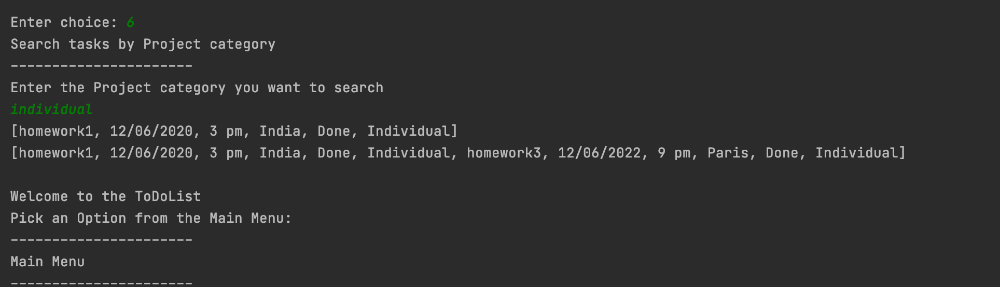
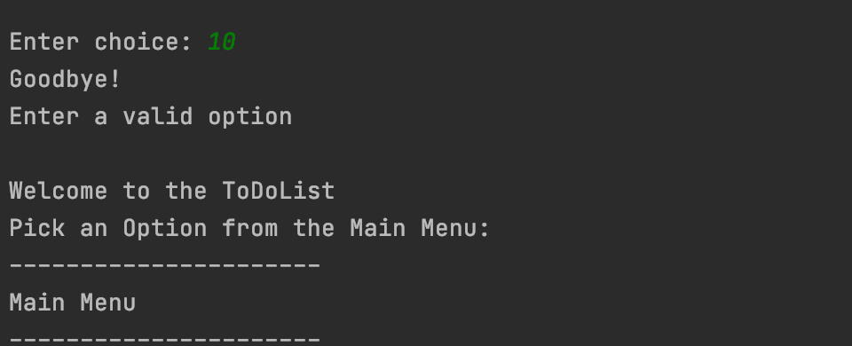

# ToDo List Application

The application will allow a user to create new tasks, assign them a title and 
due date, time ,location,status,project category and choose a project for that 
task to belong to.They will need to use a text based user interface via the
command-line.
Once they are using the application, the user should be able to also 
edit(update  title and due date, time ,location,status,project category in
the task list),sort tasks by title, due date, time ,location,status,
project category in the task list, mark as done or remove tasks,list all tasks.
They can search particular/group of tasks by Project category. They can also
quit and save the current task list to file,read the list of tasks from file
and then restart the application with the former state restored.

## Getting Started

The application can run directly via Gradle or via generated jar file.

### Run the ToDoList application

In the root folder, start the application with running main() method 
in Mainc.java file.

Once you run the application,it will show list of options (Add a task,Delete a task,
Delete all task,List all task,Sort tasks, Search for a task by Project category,
Update the items,Save the tasks in a file,Read the tasks from file,
Exit the program)from Main Menu in the 
terminal.
The user has to select one option from the Menu and go with the instructions.

## List of java class files and its functions:

ToDoList.java has the fillListForDebugging() which has list of tasks already filled.
updateItem() is for updating the task,printMenu() is for printing the list of Mainmenu.The 
showList()  is to display the list of task already available
and with the newly added tasks.The method addItem() will add the new task,removeItem()
will remove particular task from the task list. The removeAllTasks() will remove 
all tasks from the list. The sortTasks() will sort the list of tasks by title and
due date, time ,location,status,project category.The searchTasks() is to search 
particular task by project category.The writedata() will write the list of task data in
to newly created text file and readdata() will read the data(list of tasks) from 
text file.

TodoItem.java has constructor with parameters for initializing the title ,
due date, time , location,status,project category.It has the getter and setter methods for
list of tasks.

DateComparable.java contains compare(TodoItem o1, TodoItem o2) for 
sorting the list of tasks by date.

LocationComparable.java contains compare(TodoItem o1, TodoItem o2) for sorting the
list of tasks by location.

ProjectComparable.java contains compare(TodoItem o1, TodoItem o2) for sorting the
list of tasks by Project category.

StatusComparable.java contains compare(TodoItem o1, TodoItem o2) for sorting the
list of tasks by status.

TimeComparable.java contains compare(TodoItem o1, TodoItem o2) for sorting the 
list of tasks by time.

TitleComparable.java contains compare(TodoItem o1, TodoItem o2) for sorting the
list of tasks by title.

Mainc.java has main() which contains switch case for listing the Menu items.

## Usage:

This ToDoList application allows user can create new tasks,assign them a 
title, due date, time ,location, status,project category.

###After creating new Task:

###The user can edit the tasks.

###View the tasks:

###Sort the tasks:

###Remove particular tasks:

###Search tasks by project category:

The user also can write the tasks list in to new text file  by selecting menu option
8 and Read the tasks from file by selecting menu option 9.

###Quit the application:

