## *ToDo List Application*

*The application will allow a user to create new tasks, assign them a title and due date, time ,location,status,project
category and choose a project for that task to belong to.They will need to use a text based user interface via the
command-line. Once they are using the application, the user should be able to edit(update title,due date, time
,location,status,project category in the task list),sort tasks by title, due date, time ,location,status, project
category in the task list, mark as done or remove tasks,list all tasks. They can search particular/group of tasks by
Project category. They can also quit and save the current task list to file,read the list of tasks from file and then
restart the application with the former state restored.The Integer value entered by the user is validated and the date
entered by the user is also validated.If the user enters the wrong data in the place of Integer Input the application
will ask for the corrects Integer between the maximum and minimum value.*

## *Getting Started*

*The application can run directly via Gradle or via generated jar file.*
*The code for this application uses the Gradle build tool (https://gradle.org.). Instructions for installing Gradle are
available in the official documentation(https://gradle.org/install) which describes several options.*

*The application can also be run via terminal with the Gradle.The user have to download the external .jar file by
running the following commands via terminal.*
*step 1.* 
```bash
./gradlew jar
```
*step 2.*
```bash
java - jar build/libs/individual_with_gradle-1.0-SNAPSHOT.jar
``` 

## *Run the Data.ToDoList application* 

*In the root folder, start the application with running main() method in Mainc.java file.*

*Once you run the application,it will show list of options (Add a task,Delete a task, Delete all task,List all task,Sort
tasks, Search for a task by Project category, Update the items,Save the tasks in a file,Read the tasks from file, Exit
the program)from Main Menu in the terminal. The user has to select one option from the Menu and follow the
instructions.*

## *List of java class files and its functions:*

*The ToDoList.java has the fillListForDebugging() which has list of tasks already filled. The getInput(dataName) is for
getting input from the user.The method updateTask(rowNumber,itemNumber,newData) is for updating the task,printMenu() is
for printing the list of Mainmenu.The showList() is to display the list of task already available and with the newly
added tasks. The method add(title,date,time,location,status,category) will add the new task. The method validateInteger(
numberAsString,min,max) will validate the input from the user whether the given integer is between maximum and minimum
value.The validateDate(strDate)method will validate the date. The removeItem(indexNumber) will remove item from the list
based on the index.*

*The method addInMain() will get the input task from the user and call Add(title,date,time, location,status, String
category) for add the task in to list. The method removeItemInMain() get index of remove item as input from user and
call removeItem(indexNumber) to remove the task based on the index.The removeAllTasksInMain() will get confirmation from
user whether he/she wants to delete all tasks and based on the confirmation,it will call removeAllTasks(choice) to
remove all methods.*

*The method sortTasksInMain() will get the input from user by which item he/she wants to sort by and then it call
sortTask(indexNumber) for sorting. The searchTasksInMain() method will get project category as a input from the user and
they it will call searchTasks(projectName).*

*The removeAllTasks(choice) will remove all tasks from the list based on the choice. The sortTasks(indexNumber) will
sort the list of tasks by title,due date, time ,location, status, project category based on the indexNumber input from
user.The searchTasks(projectName)is to search particular task by project category. The writeData(filepath) will write
the list of task data in to newly created text file given in file path and readData(file) will read the data
(list of tasks) from text file.The size() method will return the size of the list and getList() will return the list of
tasks stored.*

*The writeDataInMain() creates a new file and it will call writeData(filePath)to write data in to file. The
readDataInMain() calls the readData(file) to read list of tasks written on file.*

*The TodoItem.java has constructor with parameters for initializing the title,due date,time,location,status, project
category.It has the getter and setter methods for list of tasks.*

*DateComparable.java contains compare(TodoItem objOne, TodoItem objTwo) for sorting the list of tasks by date.*
*LocationComparable.java contains compare(TodoItem objOne, TodoItem objTwo) for sorting the list of tasks by location.*
*ProjectComparable.java contains compare(TodoItem objOne, TodoItem objTwo) for sorting the list of tasks by Project
category.*
*StatusComparable.java contains compare(TodoItem objOne, TodoItem objTwo) for sorting the list of tasks by status.*
*TimeComparable.java contains compare(TodoItem objOne, TodoItem objTwo) for sorting the list of tasks by time.*
*TitleComparable.java contains compare(TodoItem objOne, TodoItem objTwo) for sorting the list of tasks by title.*

*The Mainc.java has main() which contains switch case for listing the Menu items and calls the particular function to
perform based on the choice selected by the user*

## *Usage:*

*This ToDoList application allows user can create new tasks,assign them a title, due date, time ,location,
status,project category and allows the user to update tasks,search the task,sort the task,delete particular tasks,
delete all tasks and save the task in a file and the user the read the saved file.*

## *Welcome to the TodoList:*

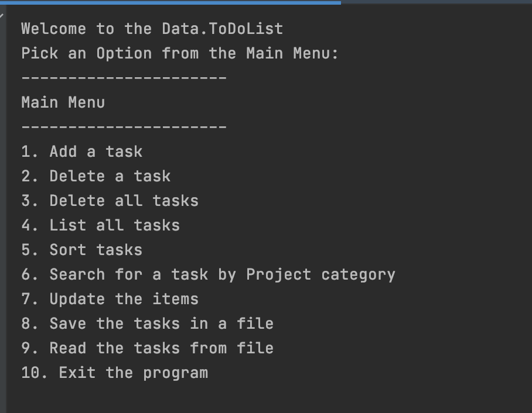

## *Add new tasks:*

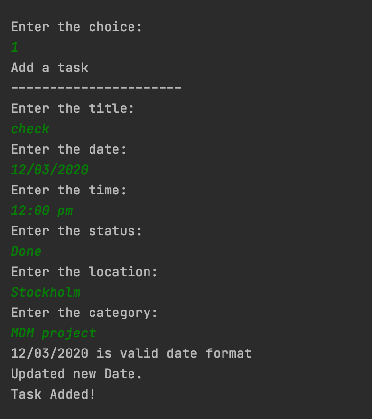

## *Remove tasks:*

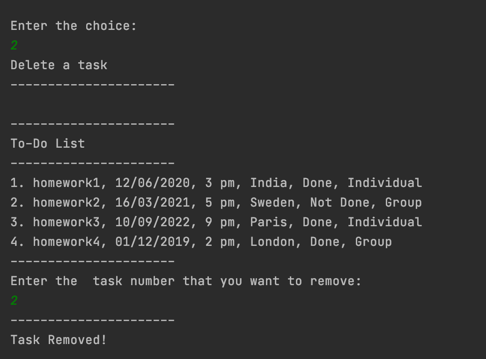

## *Remove all tasks if choice is Yes:*

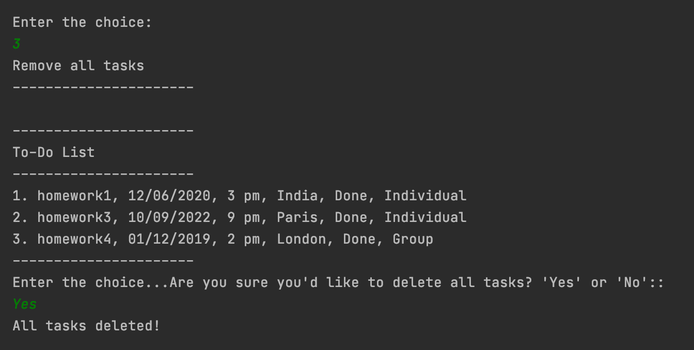

## *Remove all tasks if choice is No:*

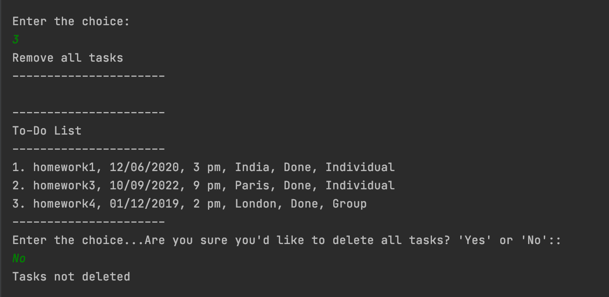

## *The user edit and update the tasks.*

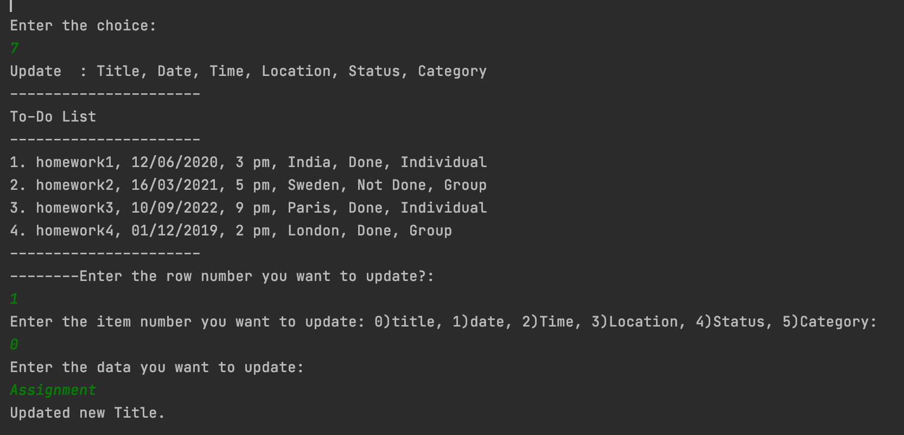

## *The user edit and update the task date.*

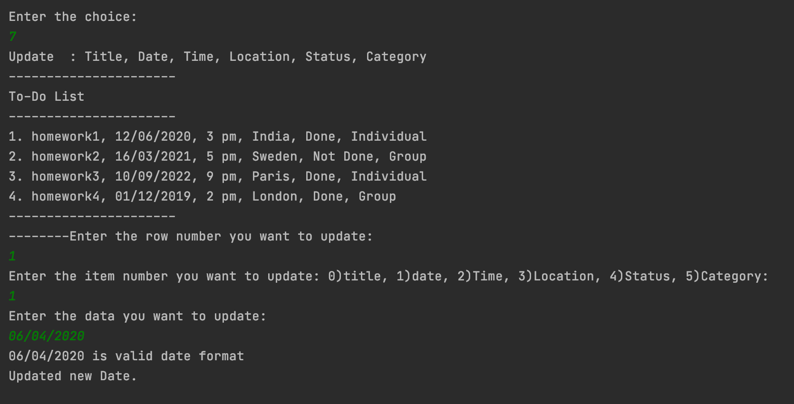

## *View the tasks:*

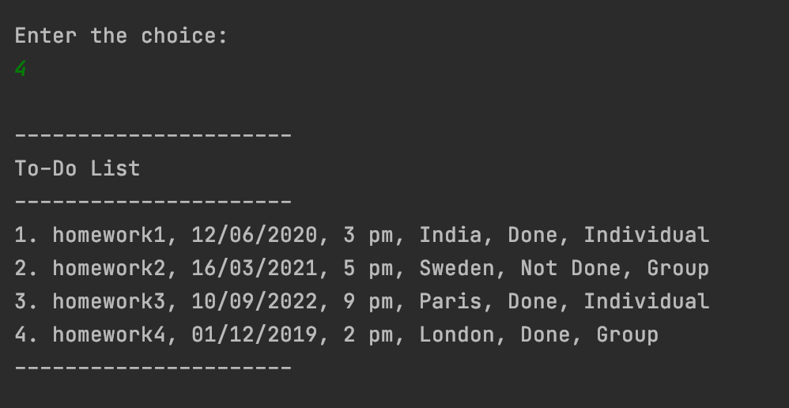

## *Sort the tasks:*

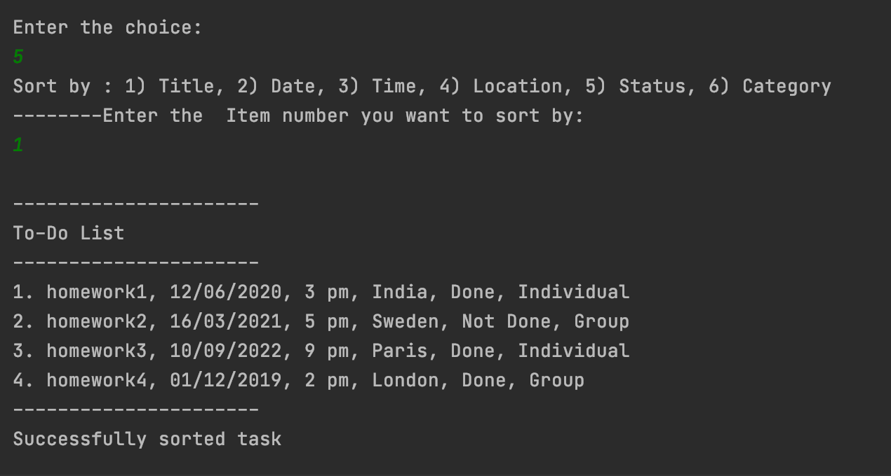

## *Search tasks by project category:*

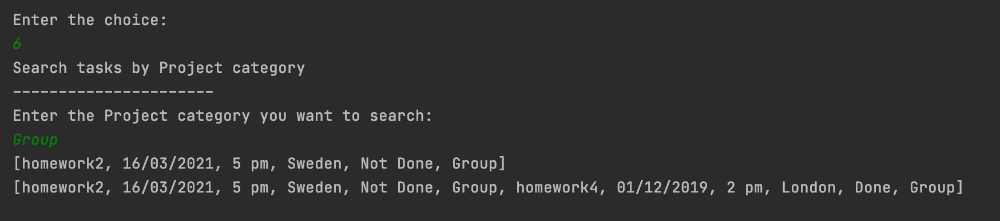

*The user also can write the tasks list in to new text file by selecting menu option 8 and Read the tasks from file by
selecting menu option 9.*

## *Validating the Integer value entered by user:*

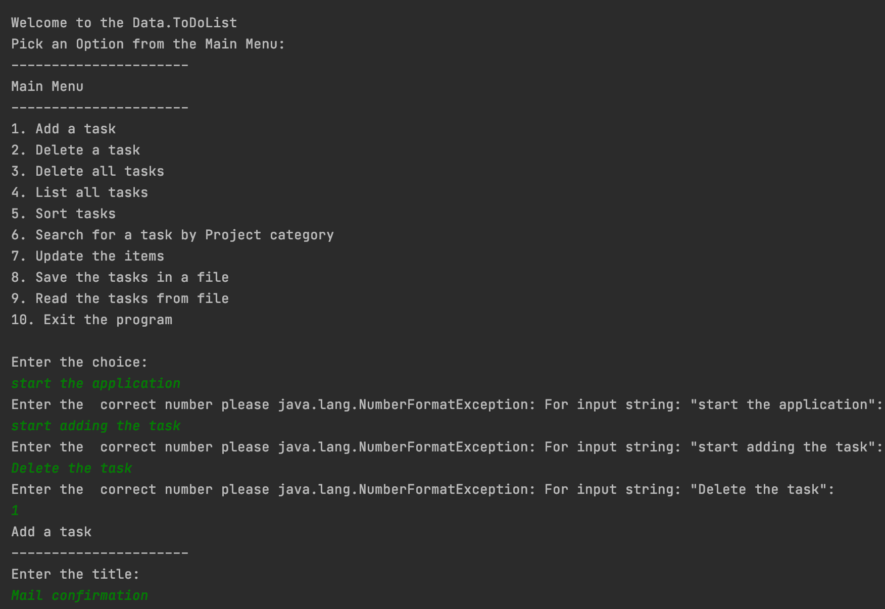

## *Validating the Date value entered by user:*

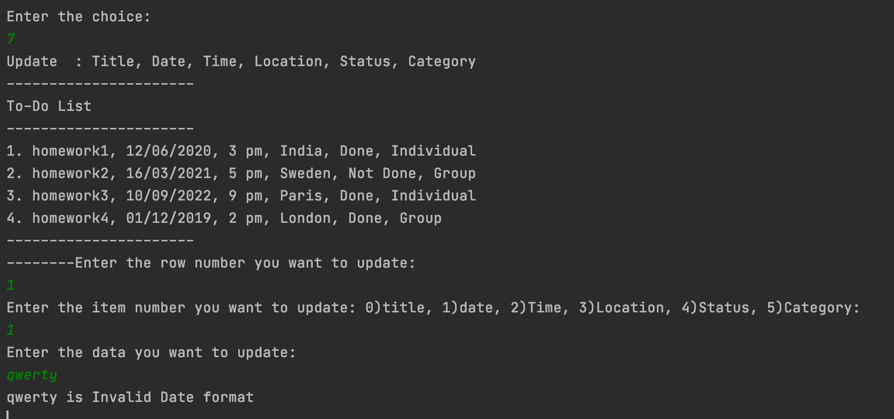

## *Quit the application:*

*The user can quit the application by selecting option 10 from menulist.*

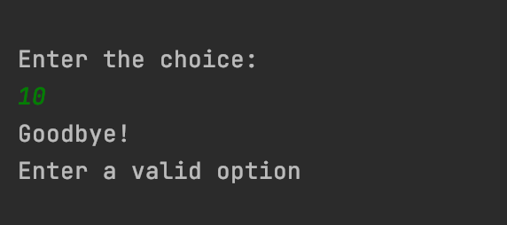


